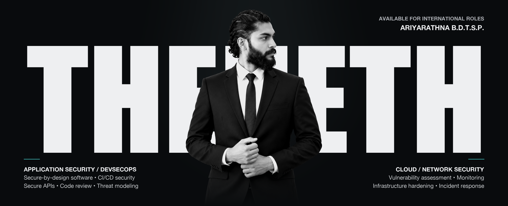

  

 

<h1 align="center">Ariyarathna B.D.T.S.P.</h1>

  <strong>Security Software Engineer · Application Security · DevSecOps</strong>

  Cloud Security · Network Security · Secure Software Development

  
  
  

  <strong>OPEN TO INTERNATIONAL · REMOTE · HYBRID OPPORTUNITIES</strong>

 

---

 

<h2>
  
  Professional profile
</h2>

  I build and secure software systems through <strong>secure-by-design engineering, practical defensive security, and DevSecOps</strong>. My experience spans secure web and mobile development, application and API security, CI/CD security, cloud and infrastructure hardening, vulnerability assessment, incident triage, network monitoring, and security automation.

  I currently work as a <strong>Security Software Developer / Engineer at Aurasync Technologies</strong> and am open to opportunities across the USA, UK, UAE, Australia, and other international markets.

 

---

 

<h2>
  
  Core expertise
</h2>

<h3>Secure software engineering</h3>

  Secure web, mobile, and API development · Application security and OWASP Top 10 · DevSecOps, SAST/DAST, and CI/CD controls · OAuth 2.0, JWT, and encrypted communications · Python and Mojo security automation

<h3>Defensive security</h3>

  Vulnerability assessment and remediation · Incident triage and security monitoring · Network and infrastructure hardening · AWS and Google Cloud security · Machine-learning-assisted anomaly detection

<h3>Security governance</h3>

  Secure SDLC · Threat modeling · Risk assessment · Secure code review · NIST Cybersecurity Framework · ISO/IEC 27001

 

---

 

<h2>
  
  Technology and security toolkit
</h2>

  
  &nbsp;&nbsp;
  
  &nbsp;&nbsp;
  
  &nbsp;&nbsp;
  
  &nbsp;&nbsp;
  
  &nbsp;&nbsp;
  
  &nbsp;&nbsp;
  

  
  &nbsp;&nbsp;
  
  &nbsp;&nbsp;
  
  &nbsp;&nbsp;
  
  &nbsp;&nbsp;
  
  &nbsp;&nbsp;
  
  &nbsp;&nbsp;
  

**Languages and development**  
Python · Mojo · JavaScript · React · Node.js · Java · C++ · Bash · REST APIs

**Application and infrastructure security**  
OWASP Top 10 · SAST · DAST · VAPT · Threat Modeling · Incident Response · SIEM

**Security tools**  
Burp Suite · Wireshark · Metasploit · Nessus · Git

**Cloud and governance**  
AWS · Google Cloud · NIST CSF · ISO/IEC 27001

 

---

 

<h2>
  
  Professional experience
</h2>

> **Security Software Developer / Engineer**  
> Aurasync Technologies · Current
>
> **Associate Information Security Analyst**  
> Sysflicx IT Solutions
>
> **Network Security Analyst Intern**  
> Avian Technologies
>
> **Machine Learning & Systems Security Specialist**  
> Independent work

 

---

 

<h2>
  
  Selected work
</h2>

<h3>Mojo beginner project series</h3>

  A practical <strong>20-project learning series</strong> progressing from language fundamentals to useful command-line applications. The collection includes a calculator, password generator, expense tracker, contact manager, file organizer, weather client, password vault, and mini shell.

  

 

<h2>
  
  Published research
</h2>

- [Developing an Optimal Strategy to Address the Vulnerability of Image Tampering](https://irjiet.com/article/Developing-an-Optimal-Strategy-to-Address-the-Vulnerability-of-Image-Tampering/1986)
- [Enhancing Organizational Time Efficiency Using Machine Learning for Employee Activity Monitoring](https://www.researchgate.net/publication/384971779_Enhancing_Organizational_Time_Efficiency_Using_Machine_Learning_for_Employee_Activity_Monitoring)

 

---

 

<h2>
  
  Education
</h2>

> **BSc (Hons) in Information Technology — Cybersecurity**  
> Kingston University
>
> **Higher National Diploma in Information Technology — Cybersecurity**  
> SLIIT

 

---

 

  <h2>Professional contact</h2>
  

    Security Software Engineering · Application Security · DevSecOps 
    Cloud Security · Network Security · Cybersecurity
  

  

    
    
    
  

 
